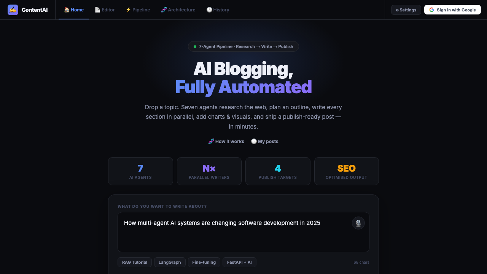
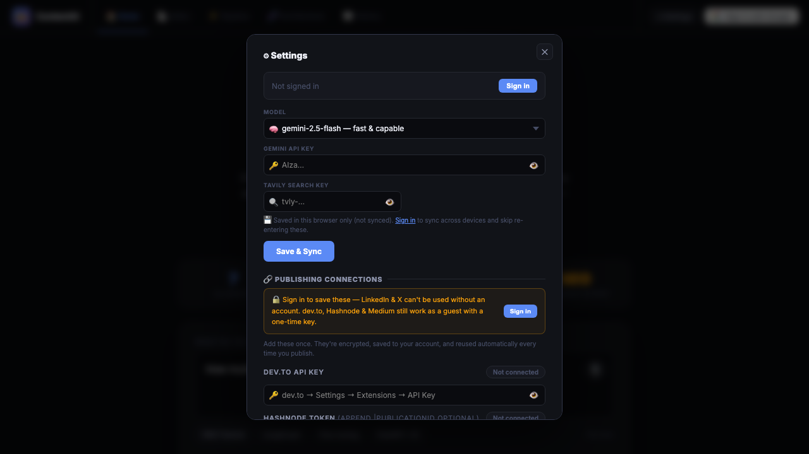
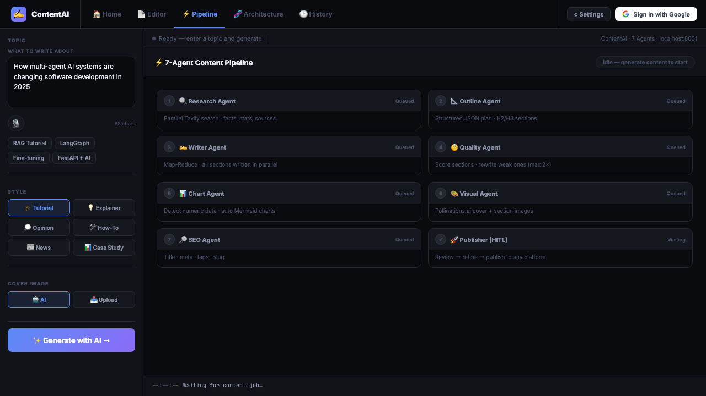
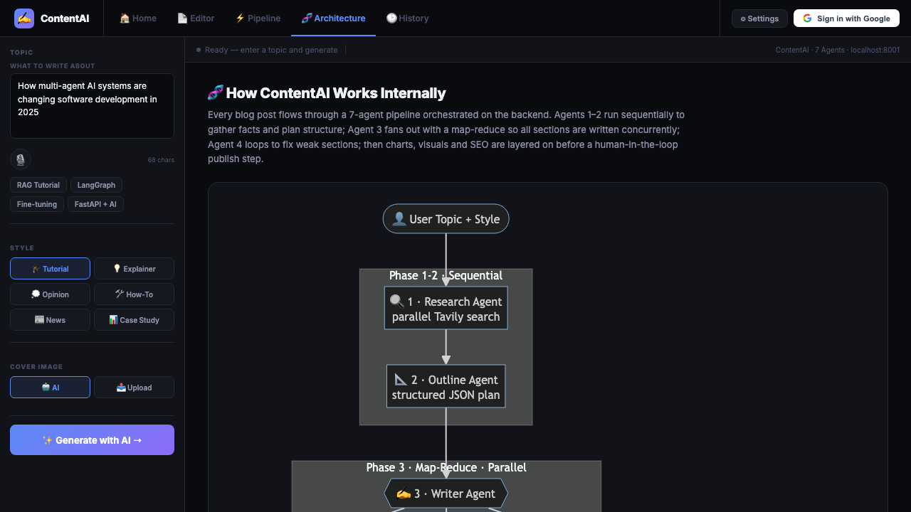
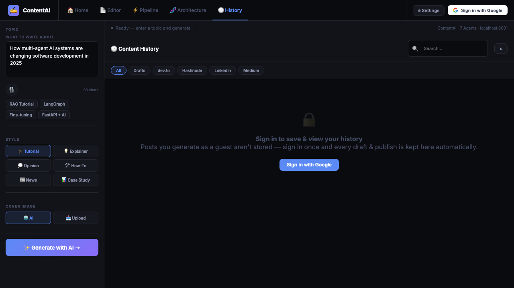

# ✍️ Quillr — AI Blog Writing, Fully Automated

> A full-stack AI content platform. Drop a topic, watch 7 agents research, write, evaluate quality, generate charts, and produce a publish-ready blog post — then ship it to 4 platforms in one click.



## Live Demo

[](https://contentai-utna.onrender.com)
[](https://github.com/ankitsharma6652/contentai)

🔗 **Live App:** https://contentai-utna.onrender.com

---

## Demo Video

https://github.com/user-attachments/assets/demo.mp4

> Full end-to-end walkthrough: topic input → 7-phase pipeline → quality scoring → editor → publish

---

## Screenshots

### Home — Enter your topic and configure the AI


### Settings — Model selection, API keys, publishing connections



### Pipeline — 7-agent pipeline, real-time phase tracking



### Architecture — How the multi-agent system works internally



### History — Every draft auto-saved, filterable by platform



---

## What it does

Quillr runs a **7-phase agentic pipeline** that takes a topic from input to published blog post with zero manual writing:

```
Phase 1 — Research       Parallel Tavily web queries (asyncio.gather)
Phase 2 — Outline        Structured JSON plan with H2/H3 sections
Phase 3 — Parallel Write Map-Reduce: all sections written concurrently (~3-4× faster)
Phase 4 — Quality Check  Score each section → rewrite weak ones, max 2 iterations
Phase 5 — Charts         Detect numeric data → inject Mermaid xychart-beta blocks
Phase 6 — Visuals        Pollinations.ai AI cover image + section images (free)
Phase 7 — SEO            Title · meta description · tags · slug · reading time
```

---

## Features

### AI Pipeline
- **Map-Reduce parallel writing** — all sections written at once with `asyncio.gather`
- **Quality evaluator loop** — LLM scores depth/clarity/examples, rewrites weak sections
- **Auto Mermaid charts** — numeric data in research → chart injected automatically
- **Free AI images** — Pollinations.ai, no API key needed
- **HITL refinement** — view quality scores → give feedback → re-run pipeline

### Editor
- Full **markdown editor** with live preview toggle (JetBrains Mono)
- Mermaid diagram rendering + syntax-highlighted code blocks
- SEO sidebar: title, meta, tags, slug, reading time

### Publishing (4 platforms)
- **dev.to** — title, markdown, tags, cover image
- **Hashnode** — Personal Access Token + optional Publication ID
- **LinkedIn** — LLM-generated 2000–2800 char post with unicode bold
- **Medium** — Integration Token

### Auth & Persistence
- **Google OAuth2** — sign in, httpOnly JWT cookie
- **Encrypted API keys** — SQLAlchemy + Fernet; stored once, reused forever
- **Neon PostgreSQL** — persistent history across deploys
- **Draft history** — every generated blog auto-saved; search, filter, reload, delete

### 50+ Models via 7 providers
Gemini · Groq · NVIDIA NIM · OpenAI · Anthropic Claude · Meta Llama · Qwen — all via a single dropdown. Groq → NVIDIA → Gemini automatic fallback chain.

---

## Tech Stack

| Layer | Tech |
|---|---|
| Backend | FastAPI + Python |
| Pipeline | Custom async 7-phase pipeline |
| LLM | LangChain (Groq / Gemini / OpenAI / NVIDIA / Euron) |
| Web search | Tavily Search API |
| Streaming | Server-Sent Events (SSE) per phase |
| Auth | Google OAuth2 + JWT (python-jose) |
| Database | PostgreSQL (Neon) via SQLAlchemy |
| Encryption | Fernet symmetric encryption |
| AI images | Pollinations.ai (free) |
| Frontend | Vanilla JS — no framework |
| Publish | dev.to v1 · Hashnode GraphQL · LinkedIn UGC v2 · Medium |
| Hosting | Render (free, keep-alive) |

---

## Environment Variables

| Variable | Required | Where to get it |
|---|---|---|
| `DATABASE_URL` | ✅ | [neon.tech](https://neon.tech) → Connection String |
| `FERNET_KEY` | ✅ | `python -c "from cryptography.fernet import Fernet; print(Fernet.generate_key().decode())"` |
| `GOOGLE_CLIENT_ID` | ✅ | [Google Cloud Console](https://console.cloud.google.com) → OAuth 2.0 |
| `GOOGLE_CLIENT_SECRET` | ✅ | Same as above |
| `CONTENT_SECRET_KEY` | ✅ | Any random string (JWT signing) |
| `GEMINI_API_KEY` | ✅ | [aistudio.google.com](https://aistudio.google.com) |
| `TAVILY_API_KEY` | ✅ | [tavily.com](https://tavily.com) |
| `GROQ_API_KEY` | optional | [console.groq.com](https://console.groq.com) |

> **Google OAuth redirect URI**: Add `https://your-render-url.onrender.com/auth/google/callback` in Google Cloud Console → OAuth → Authorized redirect URIs.

---

## Run Locally

```bash
git clone https://github.com/ankitsharma6652/contentai
cd contentai
pip install -r requirements.txt
cp .env.example .env   # fill in your keys
uvicorn content_server:app --reload --port 8001
# Open http://localhost:8001
```

---

*Built by [Ankit Sharma](https://github.com/ankitsharma6652) · 2025*
